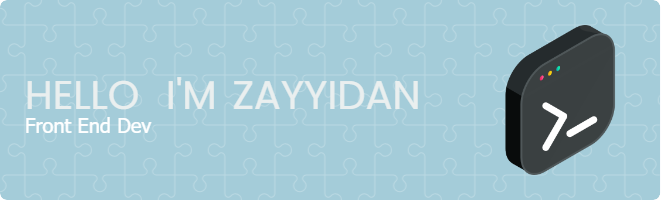

## Hello World I'm Muhammad Zayyidan 👋

<!--
**zayzay99/zayzay99** is a ✨ _special_ ✨ repository because its `README.md` (this file) appears on your GitHub profile.

Here are some ideas to get you started:

- 🔭 I’m currently working on ...
- 🌱 I’m currently learning ...
- 👯 I’m looking to collaborate on ...
- 🤔 I’m looking for help with ...
- 💬 Ask me about ...
- 📫 How to reach me: ...
- 😄 Pronouns: ...
- ⚡ Fun fact: ...
-->

🌱 I’m currently learning **HTML,CSS,JavaScript,PHP and Laravel**
🏫 I'm Study on **SMK WIKRAMA 1 Garut**

🤪😳😳😳🥶

#### Skills

#### Another Skills

#### Social Media

##### 📊 GitHub Stats:

 
 

---

<!-- Proudly created with GPRM ( https://gprm.itsvg.in ) -->

<picture>
  <source media="(prefers-color-scheme: dark)" srcset="https://raw.githubusercontent.com/zayzay99/zayzay99/output/pacman-contribution-graph-dark.svg">
  <source media="(prefers-color-scheme: light)" srcset="https://raw.githubusercontent.com/zayzay99/zayzay99/output/pacman-contribution-graph.svg">
  
</picture>

###

<!-- 

 -->